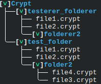
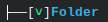

# Dekor

Simple to use general character and styling library for Rust, designed to enhance console output with various text styles and UTF-8 characters.

## Features
- **Ease of Use**: Apply multiple text styles with a single macro call or function.
- **Safety**: Macro compile-time checks prevent the use of invalid style names.
- **Flexible Styling:**: The `style!()` macro supports.
  - Generating styled strings for console output using `ANSI` codes.
  - Coloring text foreground and background.
  - Applying **bold**, <u>underline</u>(Markdown doesn't do underlined), and *italicize* the text in any combination
- **RGB Color Support**: Apply custom text colors using RGB values.
- **Comprehensive Character Set**: The `Utf8` enum provides various UTF-8 characters
  - Intention is to complete the list of characters over time
  - Character list source: <https://www.fileformat.info/info/charset/UTF-8/list.htm>
  - Implements `Display` and has the function `.repeat(n)` where `n` is `usize`

## Getting Started
To start using Dekor, add the following to your `Cargo.toml`:
```toml
[dependencies]
dekor = "0.2.1"
```
- Minimum supported Rust version: `1.56.1`

## Usage
### Basic Text Styling
```rust
use dekor::*;

fn main() {
  let decorated_text_macro = style!(Bold, Underline, FGBlue => "This is decorated text");
  println!("{}", decorated_text_macro);
  // Output will be blue text that is underlined and bolded.

  let styles = [Style::Bold, Style::Underline, Style::FGBlue];
  let decorated_text_function = style(styles, "This is decorated text");
  assert_eq!(decorated_text_macro, decorated_text_function);
}
```

### Using RGB Colors
```rust
use dekor::*;

fn main() {
    // Applying RGB colors for foreground and background
    let styles = vec![(Style::FGRGB, 255, 100, 50), (Style::BGRGB, 0, 0, 255)];
    let rgb_text_function = styler(styles, "RGB Styled Text");
    println!("{}", rgb_text_function);
    // The text will have a custom foreground and background color.

    let rgb_text_macro = style!((FGRGB, 255, 100, 50), (BGRGB, 0, 0, 255) => "RGB Styled Text");
    assert_eq!(rgb_text_function, rgb_text_macro);
}
```
### Working with UTF-8 Characters
```rust
use dekor::*;

fn main() {
  let decorated_text = style!(Bold, Underline, FGBlue => "This is decorated text");
  let pipes = format!("{}\n{}{}\n{}{}",
    Utf8::VPipeSlim, 
    Utf8::JointPipeSlim, Utf8::HPipeSlim, 
    Utf8::NodePipeSlim, Utf8::HPipeSlim,
  );

  // Output:
  // This is decorated text   <-- Will be blue text that is underlined and bolded
  // │
  // ├—   <-- Note: Markdown will display the horizontal line slimmer than it is
  // └—
  println!("{}\n{}", decorated_text, pipes);
}
```
### Example Output:

- Characters: `Utf8::VPipeSlim`, `Utf8::JointPipeSlim`, `Utf8::NodePipeCurved`, `Utf8::HPipeSlim`, and `Utf8::ModLetterDownArrowhead`
- Styles: `FGBlue`, `Bold`


```rust
use dekor::*;

fn main() {
  let folder = style!(FGBlue, Bold => "Folder"); // Style the folder
  let down_arrow = style!(Bold, FGGreen => Utf8::ModLetterDownArrowhead); // Style the open/close indicator
  let hpipe = Utf8::HPipeSlim.repeat(2); // `Utf8` implements `Display` and `.repeat()`
  println!("{}\n{}{}[{}]{}",
    Utf8::VPipeSlim, Utf8::JointPipeSlim, hpipe, down_arrow, folder
  );
}
```
## Goals
- [x] Create a macro which allows for text styling
- [x] Allow for handling RGB and Hex inputs
- [x] Provide function implementations of the macros for a more robust approach
- [x] Import characters necessary for file tree display
- [ ] Import the remaining UTF-8 characters
- [ ] Look into using escape keys for these characters as some of them do not display properly


## License
This project is licensed under the MIT License - see the [LICENSE](LICENSE) file for details.

## Contributing
._. why would you do this?
- Assisting with importing all characters into the characters library would help greatly, just branch and make a pull request.  Do your best to use the provided link and their naming schema to keep things consistent.

